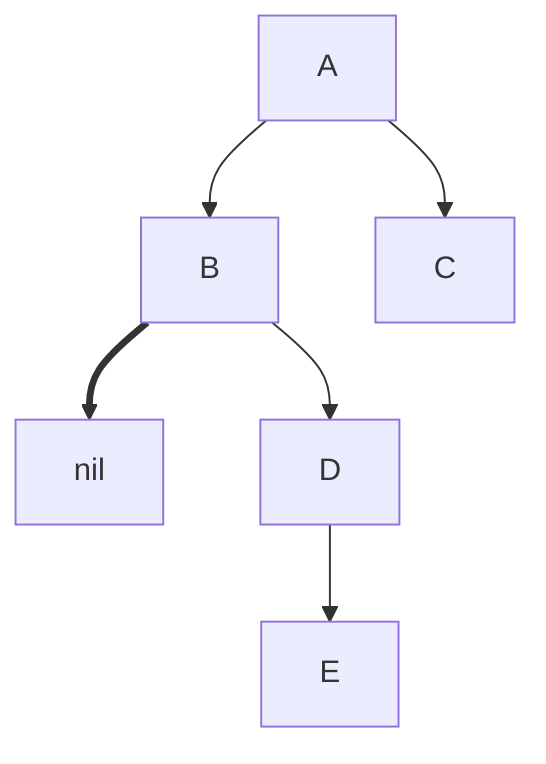
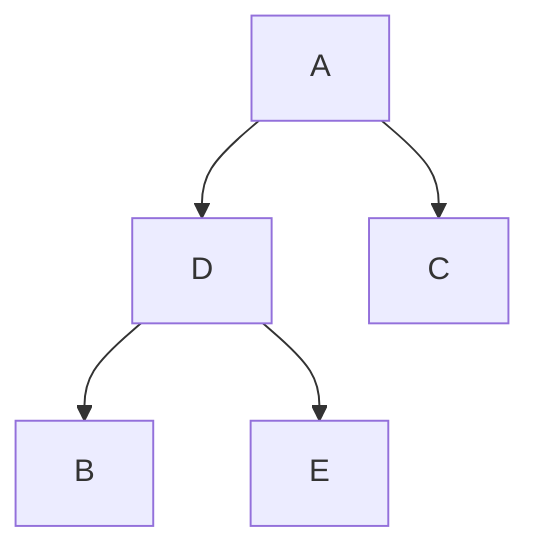
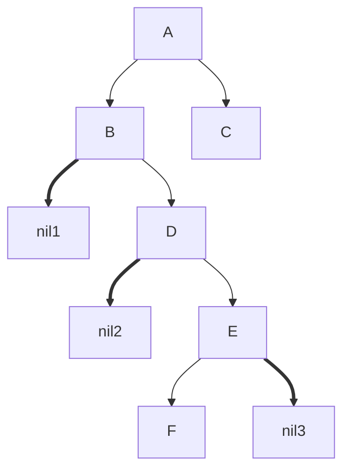

MOC:  [[Algorithms]]

---

*AVL-деревья* - вид [[Сбалансированное дерево|сбалансированных]] [[Двоичное дерево поиска|двоичных деревьев поиска]].
AVL в качестве меры баланса использую *высоту* - самый длинный путь от ноды до листа.
Высота левого и правого потомка не должны отличаться больше чем на $1$. Это число называется *фактором баланса*.

Балансировка достигается с помощью **поворотов**:
- левый поворот
- правый поворот
- лево-правый поворот
- право-левый поворот

## Левый и правый повороты
- До поворота

- Левый поворот


Правый поворот выполняется по аналогии с левым поворотом, меняются только указатели.

```swift
    private func leftRotate(_ node: AVLNode<Element>) -> AVLNode<Element> {
        
        let pivot = node.rightChild!
        node.rightChild = pivot.leftChild
        pivot.leftChild = node
        
        node.height = max(node.leftHeight, node.rightHeight) + 1
        pivot.height = max(pivot.leftHeight, pivot.rightHeight) + 1
        
        return pivot
    }
    
    private func rightRotate(_ node: AVLNode<Element>) -> AVLNode<Element> {
        
        let pivot = node.leftChild!
        node.leftChild = pivot.rightChild
        pivot.rightChild = node
        
        node.height = max(node.leftHeight, node.rightHeight) + 1
        pivot.height = max(pivot.leftHeight, pivot.rightHeight) + 1
        
        return pivot
    }```

## Право-левый и лево-правый повороты
Право-левый и лево-правые повороты выполняются, если дерево разбалансировано по разным сторонам:


В данном случае нам нужно выполнить право-левый поворот: сначала делаем правый поворот на ноде `E`, затем левый поворот на ноде `D`.

```swift
    private func rightLeftRotate(_ node: AVLNode<Element>) -> AVLNode<Element> {
        guard let rightChild = node.rightChild else {
            return node
        }
        
        node.rightChild = rightRotate(rightChild)
        return leftRotate(node)
    }
    
    private func leftRightRotate(_ node: AVLNode<Element>) -> AVLNode<Element> {
        guard let leftChild = node.leftChild else {
            return node
        }
        
        node.leftChild = leftRotate(leftChild)
        return rightRotate(node)
    }
```

## Балансировка
*Фактор баланса* может принимать два значения:
- **2** означает, что левое поддерево тяжелее чем правое. В этом случае мы применяем либо правый, либо лево-правый поворот.
- **-2** означает, что правое поддерево тяжелее чем левое. Делаем либо левый, либо право-левый поворот.

Знак фактора баланса определяет нужен один или два поворота.
```swift
    private func balanced(_ node: AVLNode<Element>) -> AVLNode<Element> {
        switch node.balanceFactor {
        case 2:
            if let leftChild = node.leftChild, leftChild.balanceFactor == -1 {
                return leftRightRotate(node)
            } else {
                return rightRotate(node)
            }
        case -2:
            if let rightChild = node.rightChild, rightChild.balanceFactor == 1 {
                return rightLeftRotate(node)
            } else {
                return leftRotate(node)
            }
        default:
            return node
        }
    }
```

## Доработка методов BST
- **Вставка**
```swift
    private func insert(from node: AVLNode<Element>?, value: Element) -> AVLNode<Element> {
        guard let node = node else {
            return AVLNode(value: value)
        }
        
        if value < node.value {
            node.leftChild = insert(from: node.leftChild, value: value)
        } else {
            node.rightChild = insert(from: node.rightChild, value: value)
        }
        
        let balanceNode = balanced(node)
        balanceNode.height = max(balanceNode.leftHeight, balanceNode.rightHeight)
        return node
    }
```

- **Удаление**
```swift
    private func remove(node: AVLNode<Element>?, value: Element) -> AVLNode<Element>? {
        guard let node = node else {
            return nil
        }
        print("Trace: \(node.value)")
        if value == node.value {
            // Leaf node, simply removing it
            if node.leftChild == nil && node.rightChild == nil {
                return nil
            }
            // No left child, reconnect right subtree
            if node.leftChild == nil {
                return node.rightChild
            }
            
            // No right child, reconnect left subtree
            if node.rightChild == nil {
                return node.leftChild
            }
            
            // Node has left and right child
            // So we are going to the right subtree's leftMost value 
			// (it will be the min value in the right subtree)
            // After that we swap node and the leftMost node values 
			// and go to right to remove the node
            node.value = node.rightChild!.min.value
            node.rightChild = remove(node: node.rightChild, value: node.value)
            
        } else if value < node.value {
            node.leftChild = remove(node: node.leftChild, value: value)
        } else {
            node.rightChild = remove(node: node.rightChild, value: value)
        }
        
        let balancedNode = balanced(node)
        balancedNode.height = max(balancedNode.rightHeight, balancedNode.leftHeight)
        return balancedNode
    }
```

