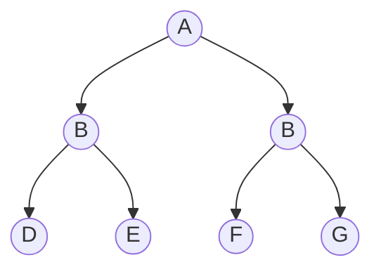
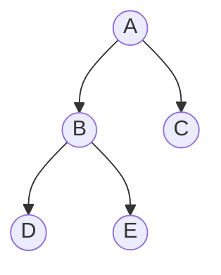

MOC:  [[Algorithms]]

---

# Идеально сбалансированное дерево

# "Довольно хорошее" сбалансированное дерево
Достичь идеального баланса получается редко. Например, его можно получить для нечетного количества нод.

